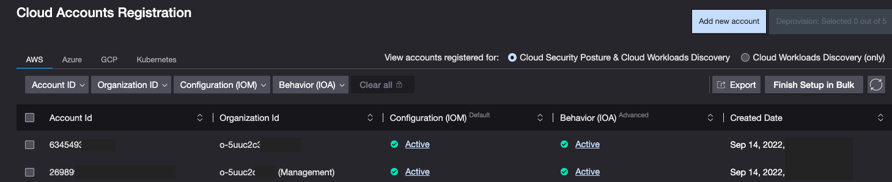

== Test the deployment

When you enroll a new AWS Control Tower–managed account, the solution will create an IAM role and event bridge forwarding rules for {partner-product-short-name}. Log in to the CrowdStrike console and navigate to the Cloud Security | Account Registration Tab and Select AWS to view your registered account.

[#CrowdStrike-CT-accounts]
.{partner-product-short-name} accounts registration page

== Cleanup
If you wish to remove the integration then please follow the following steps.

WARNING: Deleting the {partner-product-short-name} Quick Start requires that all stack instances in your org member accounts are first deleted.

=== Remove the AWS CloudFormation stack instances

The time to complete this step depends on how many AWS accounts are included in your {partner-product-name} deployment. If deleting the AWS CloudFormation stack times out, it's safe to retry this step.

. Sign in to the https://console.aws.amazon.com/console/home[AWS CloudFormation console^] in your Control Tower management account.
. Delete the {partner-product-name} stack set instances from the *CrowdStrike-CSPM-Integration*,  *CrowdStrike-CSPM-Integration-EB* and the *CrowdStrike-CSPM-Integration-Root-EB* stack sets.
. Delete the *CrowdStrike-CSPM-Integration*,  *CrowdStrike-CSPM-Integration-EB* and the *CrowdStrike-CSPM-Integration-Root-EB* stack sets
. When the stack sets have been deleted, navigate to AWS CloudFormation https://console.aws.amazon.com/cloudformation/home#/stacksets[StackSet^], and search for the CrowdStrike stack sets to confirm they were removed.
. Remove the *CrowdStrike-CSPM-Integration stack*.

NOTE: Deleting the *CrowdStrike-CSPM-Integration* stack removes the account and organisation from the accounts registration page in the falcon console.

== Best practices for using {partner-product-short-name} on AWS

For more information see the internal documentation https://falcon.crowdstrike.com/documentation/260/cspg-overview[CrowdStrike cloud security^].

