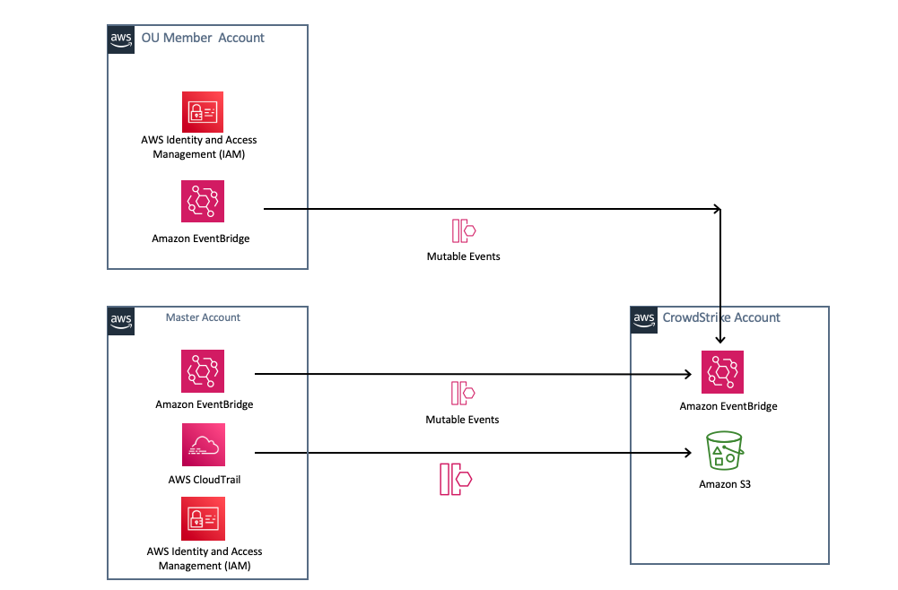

:xrefstyle: short

Deploying this Quick Start builds the following _{partner-product-name}_ environment in the
AWS Cloud.

[#CrowdStrike-CT-arch]
.{partner-product-short-name} architecture diagram

As shown in <<CrowdStrike-CT-arch>> the template will create the following

1) An IAM role in each account that is assumed by CrowdStrike to discover assets in your account.  CrowdStrike will scan these assets for *Indicators of Misconfiguration*

2) (Optional but recommended) Creates EventBridge Rules in each active region in each account that will forward cloudtrail events to CrowdStrike.  CrowdStrike uses these events to scan for *Indicators of Attack*

2) (Optional but recommended) Creates an additional *Organization Wide* CloudTrail in the master or delegated account to forward Read events from CloudTrail.

NOTE: EventBridge does not forward read events today
