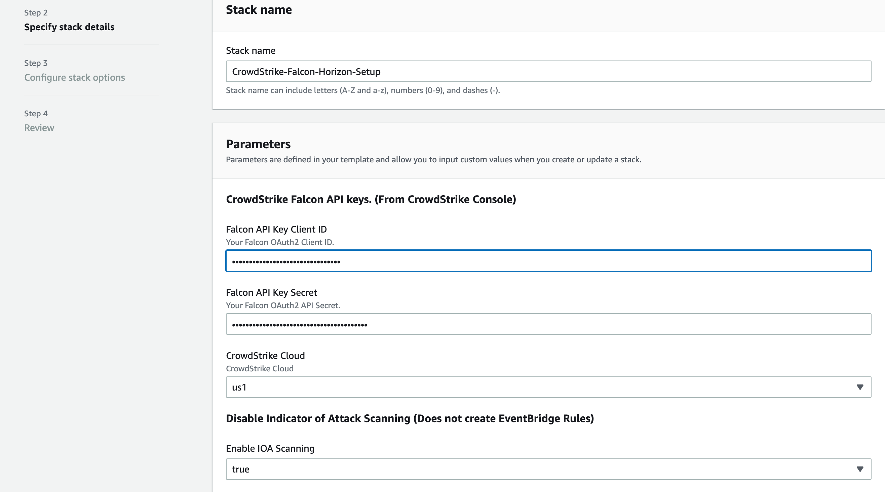
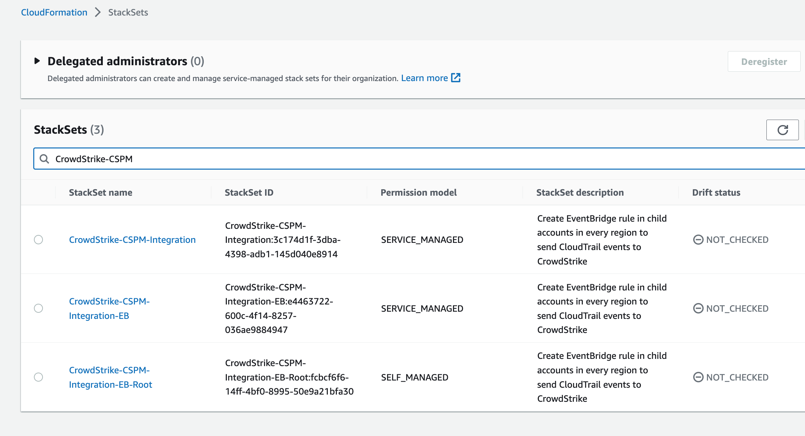
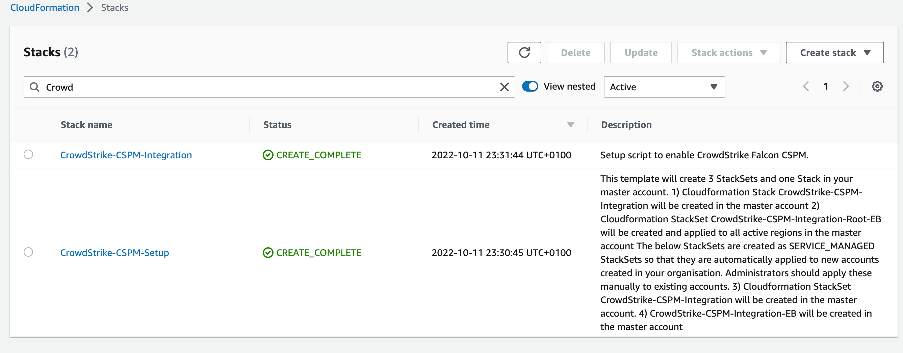
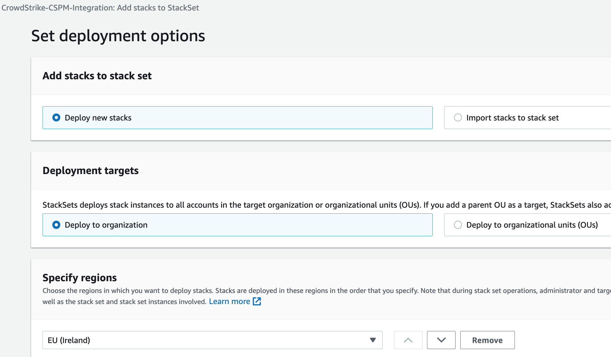
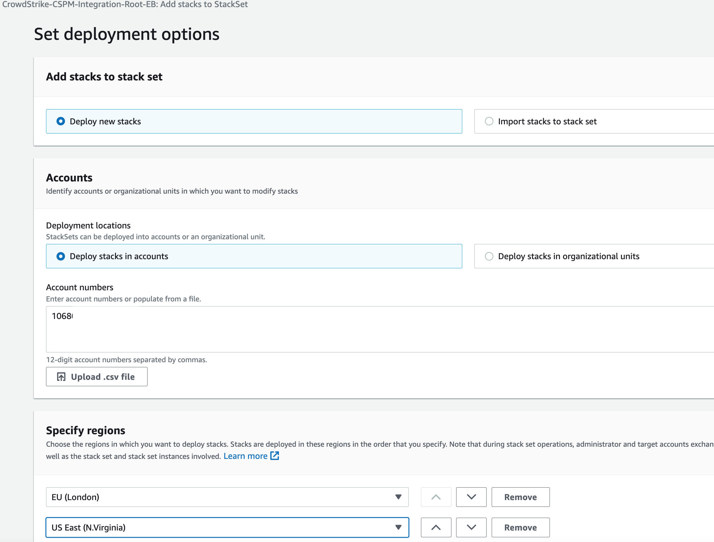
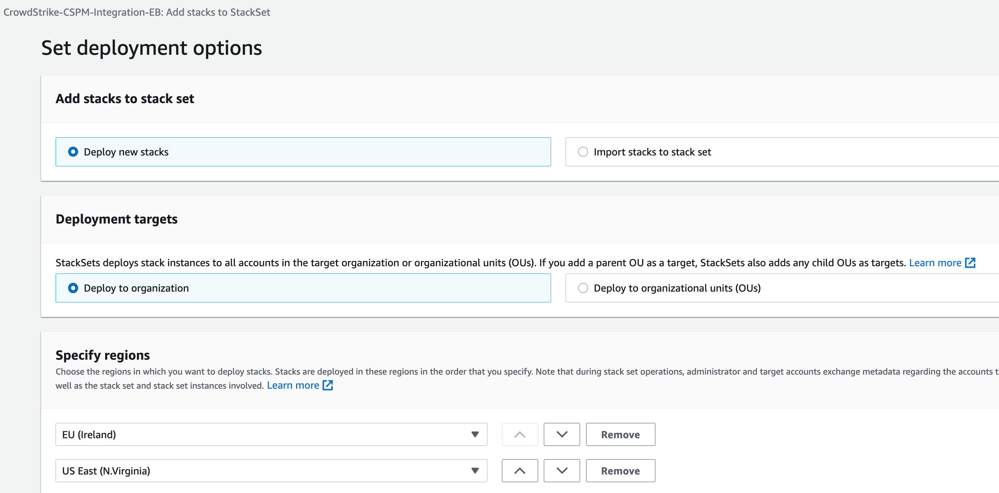

=== Confirm your AWS account configuration

. Sign in to your AWS Control Tower management account using an IAM user role that has the necessary permissions. For more information, see link:#_planning_the_deployment[Planning the deployment], earlier in this guide.
. Ensure that your AWS account is configured correctly, as discussed in the link:#_technical_requirements[Technical requirements] section.

// Optional based on Marketplace listing. Not to be edited
ifdef::marketplace_subscription[]
=== Subscribe to the {partner-product-short-name} AMI

This Quick Start requires a subscription to the AMI for {partner-product-short-name} in AWS Marketplace.

. Sign in to your AWS account.
. Navigate to the page for the {marketplace_listing_url}[{partner-product-short-name} AMI in AWS Marketplace^], and then choose *Continue to Subscribe*.
. Review the terms and conditions for software usage, and then choose *Accept Terms*. +
  A confirmation page loads, and an email confirmation is sent to the account owner. For more information, see https://aws.amazon.com/marketplace/help/200799470[Getting started^].

. When the subscription process completes, exit AWS Marketplace without further action.

IMPORTANT: Do not provision the software from AWS Marketplace—the Quick Start deploys the AMI for you.
endif::marketplace_subscription[]
// \Not to be edited

=== Launch the Quick Start
// Adapt the following warning to your Quick Start.
WARNING: If you want to enroll existing AWS accounts into {partner-product-short-name}, ensure that your AWS accounts are enrolled in AWS Control Tower. This Quick Start does not support enrolling AWS accounts from organizations that are outside of AWS Control Tower. See deployment options link:#_deployment_options[Deployment options] for more information
Sign in to your AWS Control Tower management account, and launch the AWS CloudFormation template using the following link:

** https://fwd.aws/zJYx9[Create AWS CloudFormation stack.]

1) Check the AWS Region displayed in the upper-right corner of the navigation bar, and change it if necessary. This Region is where AWS Control Tower deploys. Choose *Next*.

2) On the *Specify stack details* page, change the stack name if needed. Review the parameters for the template, and provide values for any parameters that require input. For all other parameters, review the default settings and customize them as necessary.  When you finish reviewing and customizing the parameters, choose *Next*.

NOTE: For details about each parameter, see the link:#_parameter_reference[Parameter reference] section.

3) Enter the relevant parameter values.

You will require CrowdStrike API keys with CSPM Registration Read + Write scope.  See the link:#_pre_reqs[Pre-requisites] section.

.{partner-product-short-name}Parameters Input

NOTE: For more information on the Stacks and StackSets that are created see the link:#_deployment_options[Deployment_options] section

4) Once the Cloudformation template completes, verify that the Stacks and StackSets have been created successfully.

.Example StacksSets

CloudFormation Stacks

.Example Stacks

=== Add Stacks to StackSets

1) Select the StackSet *CrowdStrike-CSPM-Integration*. Create a stack instance in a *single region* in each *account* in the organization where you have resources. The StackSet will create an IAM role in each account or ou selected.

NOTE: It is recommended that the StackSet is setup to target all OUs or the organization so that new accounts will automatically receive the template as it uses *SERVICE_MANAGED* permissions.

.Add Stacks to StackSet for the organisation

2) Select the StackSet *CrowdStrike-CSPM-Integration-Root-EB*.  Create Stacks in *every region* in the *root account* where you have resources. The StackSet will create EventBrige forwarding rules in each region selected.

.Add Stacks to StackSet (Single Region)

3) Select the StackSet *CrowdStrike-CSPM-Integration-EB*. Create Stacks in each *every region* and *account* in the organization where you have resources. The StackSet will create EventBridge rule in each region in each account or ou selected.

NOTE: It is recommended that the StackSet is setup to target all OUs or the organization so that new accounts will automatically receive the template as it uses *SERVICE_MANAGED* permissions..

.Add Stacks to StackSet (Multi Region)

=== Removal

For details about removing the template, see the link:#_additional_info[Additional Inforamation] section.