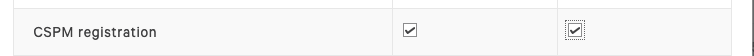

// If no preperation is required, remove all content from here

==== Prepare your AWS Control Tower account

AWS Control Tower must be deployed before launching this Quick Start. For information about setting up an AWS Control Tower landing zone, see https://docs.aws.amazon.com/controltower/latest/userguide/getting-started-with-control-tower.html[Getting Started with AWS Control Tower^]. 

==== Prepare your {partner-company-name} account

When using CrowdStrike Horizon you must have an active subscription and the permissions to create CrowdStrike API keys for the following scope
*CSPM Registration Read + Write*

==== Prepare for the deployment

. {partner-company-name} CID
+
This Quick Start integrates your AWS Orgainisation with a single {partner-company-name} CID. https://falcon.crowdstrike.com/login/[Log in to your {partner-company-name} account] and create your CSPM Registration Keys. For more information, see https://falcon.crowdstrike.com/documentation/137/falcon-horizon-apis[Falcon Horizon Keys^].

